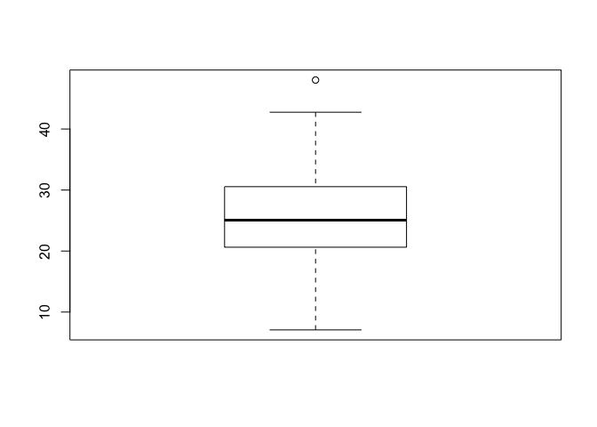
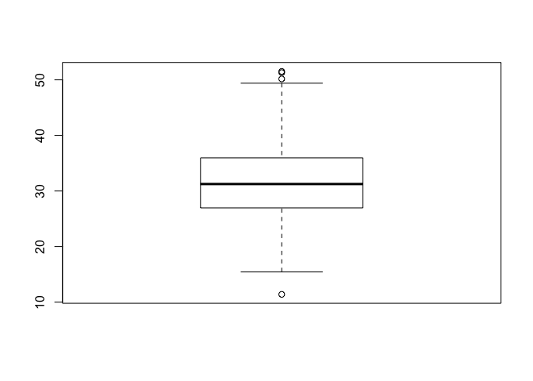
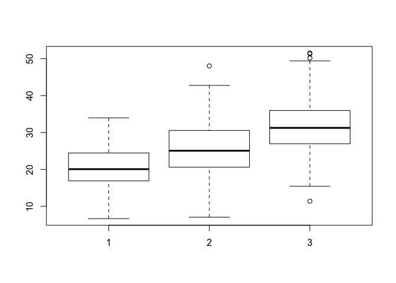

class13
================

``` r
mxl <- read.csv("373531-SampleGenotypes-Homo_sapiens_Variation_Sample_rs8067378.csv")
```

``` r
genotype <- mxl$Genotype..forward.strand.
```

``` r
table(genotype)
```

    ## genotype
    ## A|A A|G G|A G|G 
    ##  22  21  12   9

``` r
table(genotype) / nrow(mxl) * 100
```

    ## genotype
    ##     A|A     A|G     G|A     G|G 
    ## 34.3750 32.8125 18.7500 14.0625

``` r
library(gtools)
library(seqinr)

chars <- s2c("DDDDCDEDCDDDDBBDDDCC@")
chars
```

    ##  [1] "D" "D" "D" "D" "C" "D" "E" "D" "C" "D" "D" "D" "D" "B" "B" "D" "D"
    ## [18] "D" "C" "C" "@"

``` r
phred <- asc(chars) - 33
phred
```

    ##  D  D  D  D  C  D  E  D  C  D  D  D  D  B  B  D  D  D  C  C  @ 
    ## 35 35 35 35 34 35 36 35 34 35 35 35 35 33 33 35 35 35 34 34 31

``` r
# IP = 149.165.156.169
```

``` r
res <- read.table("rs8067378_ENSG00000172057.6.txt")
#head(res)
#table(res$geno)
gg <- res$geno == "G/G"
gg_expr <- res[gg, "exp"]
mean(gg_expr)
```

    ## [1] 20.59371

``` r
#summary(res)
boxplot(gg_expr)
```


``` r
ag <- res$geno == "A/G"
ag_expr <- res[ag, "exp"]
mean(ag_expr)
```

    ## [1] 25.3968

``` r
boxplot(ag_expr)
```



``` r
aa <- res$geno == "A/A"
aa_expr <- res[aa, "exp"]
mean(aa_expr)
```

    ## [1] 31.81864

``` r
boxplot(aa_expr)
```



``` r
boxplot(gg_expr, ag_expr, aa_expr)
```



``` r
boxplot(exp ~ geno, data=res, notch =T)
```


